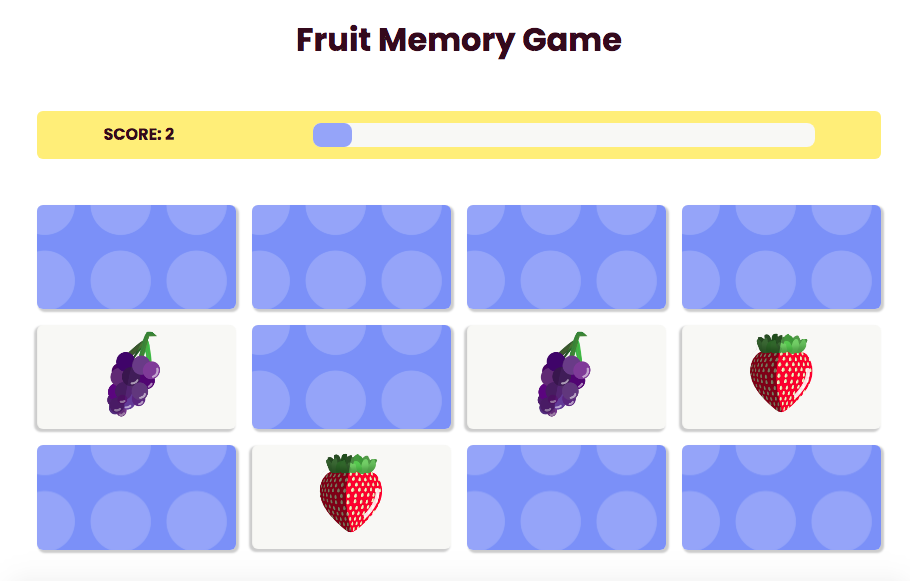

## Description.

Memory Game is the basic well-known card matching game for the brain training.

This app  was bootstrapped with Create React App. It is a studying project aimed to practise  **React Hooks**, **CSS Grid** and **CSS Animation**. 

## Where to Play

You can play it [here](https://olsamar.github.io/memory-game-react/)

## Game Rules

A user is offered 6 pairs of cards with fruit that are randomly sorted and 15 second to complete the game. 

If two matching cards are open 1.5s is added. 

If the time is over a user gets a message and can start the game again. 

